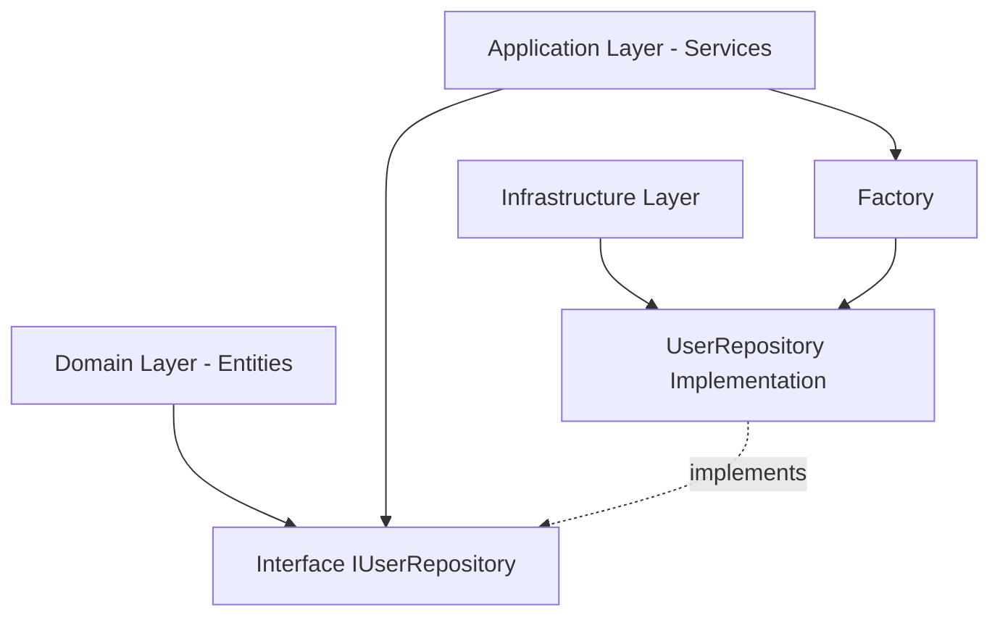

# Padrão Híbrido de Repositórios - DDD Implementation

## ✅ IMPLEMENTAÇÃO CONCLUÍDA

Foi implementado com sucesso o **padrão híbrido de repositórios** seguindo os princípios de Domain-Driven Design (DDD), onde:

- **Interfaces ficam nas entidades** (domínio conceitual)
- **Implementações ficam na infraestrutura** (camada técnica)

## 🏗️ Estrutura Implementada

```
src/
├── entities/                          # DOMÍNIO - Interfaces e contratos
│   ├── user/
│   │   ├── userEntity.ts              # ✅ Entidade e validações
│   │   ├── userRepository.interface.ts # ✅ Interface do repositório (NOVO)
│   │   └── index.ts
│   └── deadLetterQueue/
│       └── dlqRepository.interface.ts  # ✅ Interface DLQ (NOVO)
│
├── infraestructure/                   # INFRAESTRUTURA - Implementações
│   ├── repositories/                  # ✅ NOVA PASTA
│   │   ├── user.repository.ts         # ✅ Implementação UserRepository (NOVO)
│   │   ├── repository.factory.ts      # ✅ Factory para injeção de dependências (NOVO)
│   │   └── index.ts                   # ✅ Exports centralizados (NOVO)
│   └── mongo/
│       ├── baseRepository.ts          # ✅ Repository base existente
│       └── interfaces.ts              # ✅ Interfaces base existentes
│
└── modules/
    └── auth/
        └── factory/
            └── auth.factory.ts         # ✅ Atualizado para usar novo padrão
```

## 🎯 Benefícios Implementados

### 1. **Separação de Responsabilidades**

- **Entidades**: Definem CONTRATOS (interfaces) - o "O QUE"
- **Infraestrutura**: Implementa TECNOLOGIA (classes) - o "COMO"

### 2. **Testabilidade Aprimorada**

- Interfaces permitem mocking fácil para testes
- Implementações concretas isoladas na infraestrutura

### 3. **Flexibilidade de Implementação**

- Múltiplas implementações (MongoDB, PostgreSQL, In-Memory)
- Troca de tecnologia sem impacto no domínio

### 4. **Injeção de Dependências**

- Factory pattern para criação de instâncias
- Singleton e factory methods disponíveis

## 📋 Arquivos Criados/Modificados

### ✅ **Novos Arquivos Criados**

1. `src/entities/user/userRepository.interface.ts` - Interface pura do domínio
2. `src/entities/deadLetterQueue/dlqRepository.interface.ts` - Interface DLQ
3. `src/infraestructure/repositories/user.repository.ts` - Implementação técnica
4. `src/infraestructure/repositories/repository.factory.ts` - Factory para DI
5. `src/infraestructure/repositories/index.ts` - Exports centralizados

### ✅ **Arquivos Modificados**

1. `src/modules/auth/factory/auth.factory.ts` - Atualizado para novo padrão

## 🔧 Como Usar o Novo Padrão

### **1. Importar a Interface (Domínio)**

```typescript
import type { IUserRepository } from '../../entities/user/userRepository.interface.js';
```

### **2. Obter Implementação (Factory)**

```typescript
import { getUserRepository } from '../../infraestructure/repositories/index.js';

const userRepo = getUserRepository(); // Singleton
// ou
const userRepo = createUserRepository(); // Nova instância
```

### **3. Usar nas Classes de Serviço**

```typescript
export class UserService {
  constructor(private userRepo: IUserRepository) {}

  async findUser(id: string) {
    return this.userRepo.findById(id);
  }
}
```

### **4. Injeção via Factory**

```typescript
export class AuthService {
  private userRepository: IUserRepository;

  constructor() {
    this.userRepository = getUserRepository();
  }
}
```

## 📚 Interfaces Implementadas

### **IUserRepository** (Completa - 26 métodos)

- ✅ CRUD operations (create, read, update, delete)
- ✅ Authentication (validatePassword, findByEmail)
- ✅ Password reset (generateToken, resetWithToken)
- ✅ Email verification (generateToken, verifyWithToken)
- ✅ User status (activate, deactivate, suspend)
- ✅ Role management (findByRole, updateRole)
- ✅ Statistics (getUserStats, findRecentUsers)
- ✅ Bulk operations (multiple users, cleanup)
- ✅ Pagination support (all list methods)

### **IDeadLetterQueueRepository** (Interface Criada)

- ✅ CRUD operations with pagination
- ✅ Reprocessing operations
- ✅ Statistics and monitoring
- ✅ Cleanup operations
- ✅ Batch operations

## ⚡ Compilation Status

```bash
✅ pnpm run build  # SUCESSO - TypeScript compila sem erros
```

## 🔄 Próximos Passos (Opcionais)

1. **Mover repositório do Auth** para seguir mesmo padrão
2. **Criar interfaces para DLQ** e outros repositórios
3. **Implementar repositórios alternativos** (PostgreSQL, In-Memory)
4. **Atualizar testes** para usar interfaces ao invés de implementações
5. **Documentar factory patterns** específicos por módulo

## 💡 Padrão de Arquitetura Alcançado



**Resumo**: Interface no domínio, implementação na infraestrutura, injeção via factory - padrão DDD híbrido implementado com sucesso! ✅
